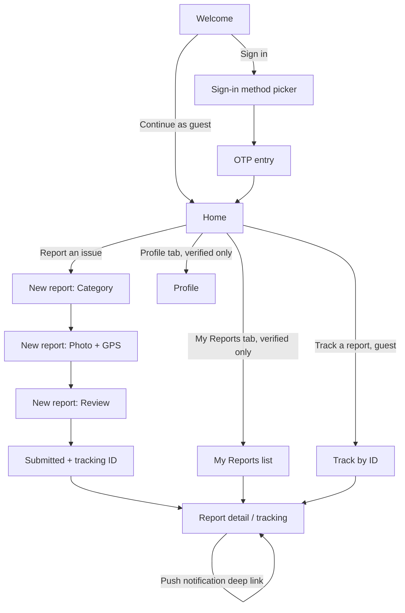
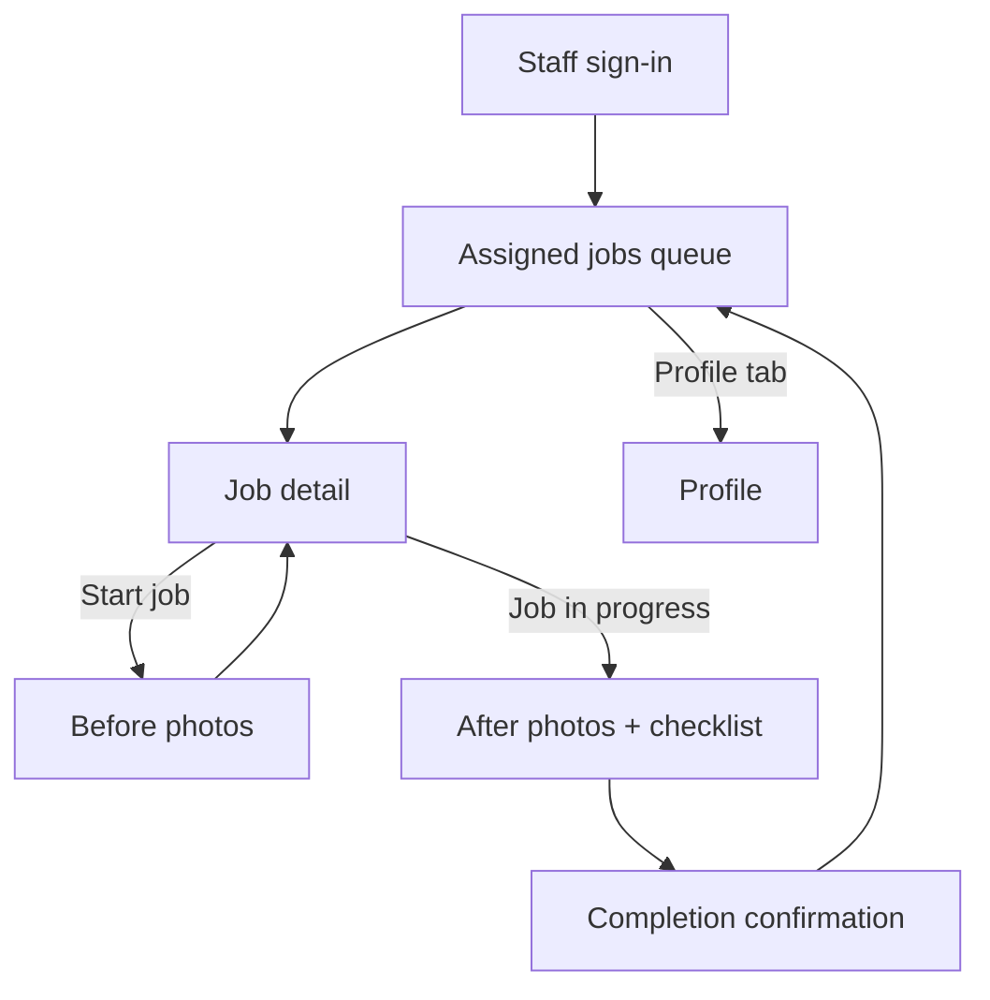

# Screens & Navigation

Visual reference for every screen marked **✅ wireframed** below: **[Aninag — Mobile UI Concepts](https://claude.ai/code/artifact/e745faa6-fbdc-46c4-ab0d-0a7b8461c9d5)**. Screens marked **⚠️ not yet wireframed** are structurally required (they're in the navigation map and route table because the app can't ship without them) but still need a visual pass — flagged here rather than silently assumed.

## Citizen app

### Route table

| Path | Screen | Auth | Wireframe |
|---|---|---|---|
| `/welcome` | Welcome / entry choice | Public | ✅ |
| `/auth/sign-in` | Sign-in method picker (Google/Apple/Email/Phone) | Public | ⚠️ |
| `/auth/otp` | OTP entry (email or phone) | Public | ⚠️ |
| `/home` | Home / nearby-reports transparency feed | Guest or Verified | ✅ |
| `/reports/new/category` | New report — step 1: category | Guest or Verified | ✅ |
| `/reports/new/capture` | New report — step 2: photo + GPS | Guest or Verified | ✅ |
| `/reports/new/review` | New report — step 3: details + review | Guest or Verified | ✅ |
| `/reports/new/submitted` | Submission confirmation + tracking ID | Guest or Verified | ✅ |
| `/reports/track` | Guest: look up a report by tracking ID | Guest only | ⚠️ |
| `/reports` | My Reports (history list) | Verified only | ✅ |
| `/reports/:id` | Report detail / tracking timeline | Submitter (guest via tracking ID, or verified) | ✅ |
| `/profile` | Account, notification preferences, sign out | Verified only | ⚠️ |

**Why Guests get `/reports/track` instead of `/reports`:** a Guest has no account to list history against (FR-1.1) — they hold only the tracking ID(s) issued at submission. `/reports/:id` is reachable either from that lookup or directly from a push notification deep link; `/reports` (the full history list) requires an identity to list "reports belonging to me" against, so it's Verified-only by construction, not by an arbitrary permission flag.

### Navigation flow

## Worker app

### Route table

| Path | Screen | Auth | Wireframe |
|---|---|---|---|
| `/auth/sign-in` | Staff sign-in (email/phone, org-issued account) | Public | ⚠️ |
| `/jobs` | Assigned jobs queue | Worker | ✅ |
| `/jobs/:id` | Job detail | Worker (assigned only) | ✅ |
| `/jobs/:id/before-photos` | Before-photo capture | Worker (assigned only) | ✅ |
| `/jobs/:id/complete` | After-photo capture + checklist | Worker (assigned only) | ✅ |
| `/jobs/:id/completed` | Completion confirmation | Worker (assigned only) | ✅ |
| `/profile` | Account, sign out | Worker | ⚠️ |

There is no Worker-app guest mode and no self-registration flow — Worker accounts are provisioned by a Department Head/City Hall Administrator through the (separate, web) admin dashboard, consistent with [FR-6.2](../docs/04-functional-requirements.md#fr-6--assignment--worker-execution): a Worker only ever operates within jobs assigned to them, never a self-service signup path.

### Navigation flow

## Route guard rules (both apps)

Enforced centrally in `core/routing` (see [App Architecture — Navigation](02-app-architecture.md#navigation--gorouter)), not per-screen:

- Any route requiring **Verified** or **Worker** auth redirects to the relevant sign-in screen if the session is missing or expired.
- The Worker app's `jobs/:id*` routes additionally check the job's `assigned_worker_id` against the current session before rendering — a 403/`NotFoundError` from the API (see [API Integration — Error Handling](06-api-integration.md#error-handling)) on any route the user shouldn't reach routes to a generic "not available" screen, never a blank crash, since this is a case the API is expected to actually return (per [Security — Authorization](../docs/09-security.md#authorization-model)).
- Deep links (push notification → `/reports/:id` or `/jobs/:id`) that arrive while signed out queue the target route and replay it immediately after successful sign-in, rather than dropping the destination.

## Screens intentionally out of scope for MVP mobile

- In-app chat/messaging between citizen and staff (not in [PRD](../docs/03-prd.md) MVP scope).
- Any Barangay/Department/City Hall screen — those are web dashboard scope, a separate doc set.
- Multi-report bulk actions (e.g., a Worker completing several jobs at once) — FR-6 assumes one job at a time; revisit only if pilot usage shows this is a real friction point.
