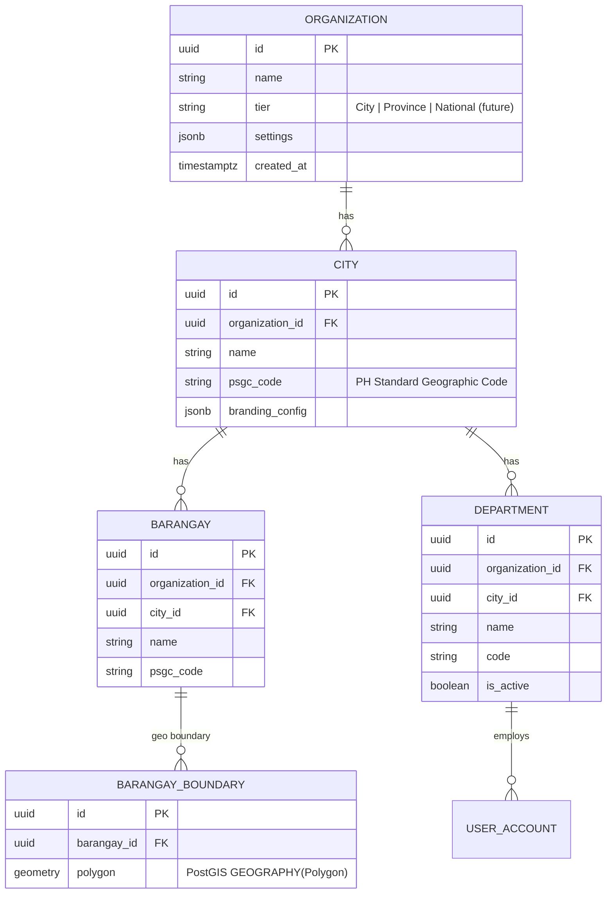
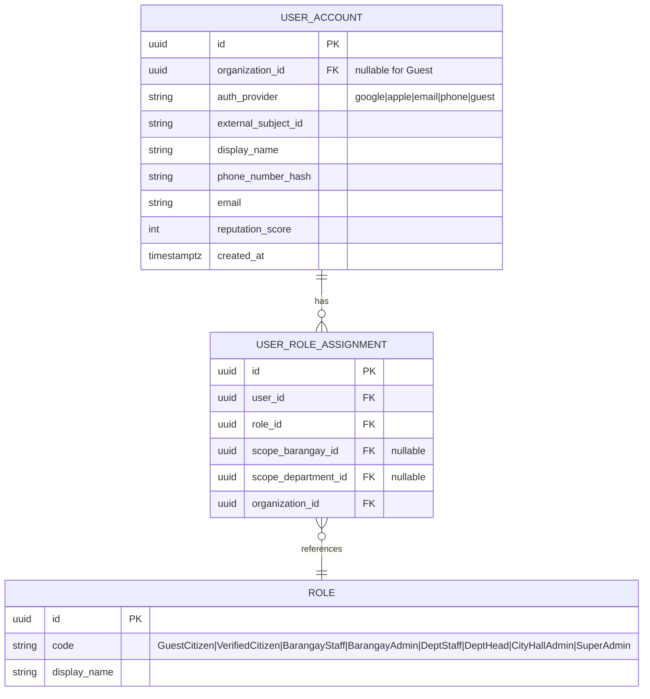
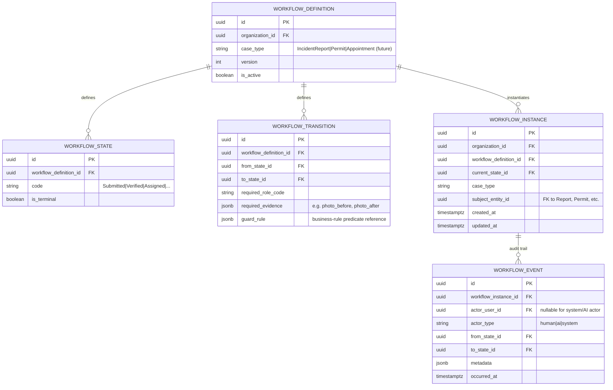
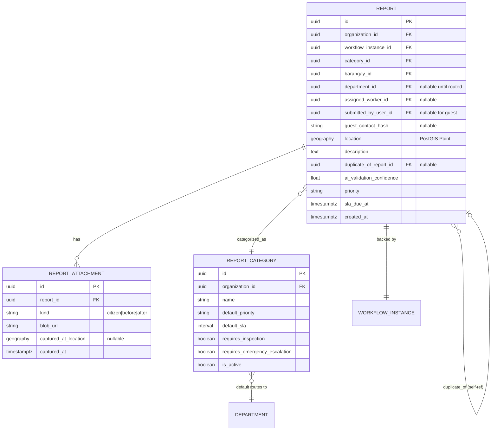

# Database Design & ER Model

Database: **PostgreSQL 16 + PostGIS**. Naming: singular PascalCase entities in this doc, mapped to `snake_case` tables via a TypeORM `SnakeNamingStrategy`. All identifiers are UUIDv7 (time-ordered, index-friendly, and safe to generate client-side without a round trip — relevant for offline draft creation, see [NFR — Offline Support](05-non-functional-requirements.md#offline-support)).

## Tenant scoping

Every tenant-owned table includes `organization_id UUID NOT NULL REFERENCES organization(id)`, indexed as the leading column of its primary access-pattern index (e.g., `(organization_id, status, created_at)` on `report`). This is enforced two ways, not one:

1. **Application layer:** a shared NestJS interceptor/guard resolves the current tenant and a TypeORM subscriber/base-repository wrapper injects `WHERE organization_id = @currentTenant` on every query against a tenant-scoped entity (see [Architecture — Multi-Tenancy](06-architecture.md#multi-tenancy-strategy)).
2. **Database layer (defense in depth):** PostgreSQL Row-Level Security (RLS) policies on tenant-scoped tables, keyed to a session variable set at the start of each request's transaction. If the application layer's filter is ever bypassed by a bug, RLS is the second, independent barrier — this is the difference between "we tried to prevent cross-tenant leaks" and "cross-tenant leaks are structurally impossible short of a superuser bypassing RLS deliberately," which matters enormously for a government-data product.

`Organization`, `City`, and reference/seed tables not owned by a single tenant (e.g., a shared national Barangay boundary dataset used as fallback) are the only tables without `organization_id`.

## Core entity groups

### 1. Tenancy & Government Hierarchy

**Design note — PSGC codes:** every `City` and `Barangay` stores the official Philippine Standard Geographic Code alongside its internal UUID. This is not decorative — it is the join key for any future integration with national datasets (PSA statistics, DILG reporting, disaster-response coordination with national agencies), and retrofitting it after tenants have organically-named barangays would require an error-prone reconciliation pass. Cheap to capture at onboarding, expensive to backfill.

### 2. Identity & Access

**Design note — scoped role assignments, not global roles:** `UserRoleAssignment` carries an optional `scope_barangay_id`/`scope_department_id` rather than roles being purely global-per-organization. This is what lets one user be, e.g., Barangay Staff for Barangay A only, while another is City Hall Administrator across the whole City — and it's what the RBAC engine in [Security](09-security.md#authorization-model) evaluates against. A flat "role per organization" model (rejected) would force one of two bad outcomes: over-broad access (any Barangay Staff sees all barangays) or a proliferation of organization-per-barangay tenants (defeats the point of the City tenant).

### 3. Workflow Engine (generic)

`WORKFLOW_EVENT` **is** the audit log for every workflow-driven entity (FR-10) — a single, generic, append-only table rather than a separate audit table per module. This directly delivers FR-10.2 (no application-layer update/delete path is ever defined for this table) and means Permits, Appointments, and Inspections get full audit history for free the moment they're modeled as workflows, rather than each module needing to reinvent audit logging.

### 4. Incident Reporting (module-specific)

**Design note — `Report` references a `WorkflowInstance` (1:1) rather than embedding status directly:** the report's current status is always read through its `WorkflowInstance.current_state`, not a duplicated `status` column on `Report` itself. This avoids the classic bug class where a workflow-engine-driven status and a denormalized status column on the domain entity drift out of sync. The `Report` table stays focused on domain data (location, category, attachments); the Workflow Engine owns state and transitions exclusively.

**Design note — GPS as `geography`, not two floats:** using PostGIS `GEOGRAPHY(Point, 4326)` rather than separate `latitude`/`longitude` columns is what makes FR-3.1's radius-based duplicate search and FR-4.1's point-in-polygon barangay resolution simple, correct, and index-accelerated (`GIST` index) queries rather than manually implemented haversine math in application code — the latter is a common source of subtle correctness bugs (e.g., mishandling the antimeridian, or radius math that's wrong at scale) that PostGIS has already solved and battle-tested.

## Indexing strategy (MVP-critical)

| Index | Purpose |
|---|---|
| `report(organization_id, barangay_id, current_state, created_at)` (via workflow join or denormalized state cache — see below) | Barangay queue load (FR-5.1), the highest-frequency staff query |
| `report USING GIST(location)` | Duplicate radius search (FR-3.1), barangay point-in-polygon resolution (FR-4.1) |
| `barangay_boundary USING GIST(polygon)` | Same |
| `workflow_event(workflow_instance_id, occurred_at)` | Audit trail retrieval for a single case |
| `user_role_assignment(user_id, organization_id)` | Auth/permission resolution on every authenticated request — must be fast, it's on the hot path |

**Deliberate denormalization called out:** to avoid an expensive join to `WorkflowInstance`/`WorkflowState` on every dashboard query, `Report` maintains a denormalized `current_state_code` column, updated transactionally in the same write as the `WorkflowEvent` insert. This is a standard CQRS-adjacent read-optimization, not a violation of "status lives in the workflow engine" — the `WorkflowInstance` remains the source of truth; the denormalized column is a cache invalidated within the same transaction, never written independently.

## Data retention & deletion

- `WORKFLOW_EVENT` (audit log) is retained indefinitely by default — it is the platform's accountability record and a likely subject of future transparency/FOI requirements.
- Citizen accounts support data-subject erasure requests (RA 10173 compliance, see [Security](09-security.md#compliance)): PII fields on `USER_ACCOUNT` are nulled/anonymized on request, but `WORKFLOW_EVENT` and `REPORT` rows are retained with the actor reference pointing to an anonymized placeholder, preserving audit integrity without retaining erasable PII.
