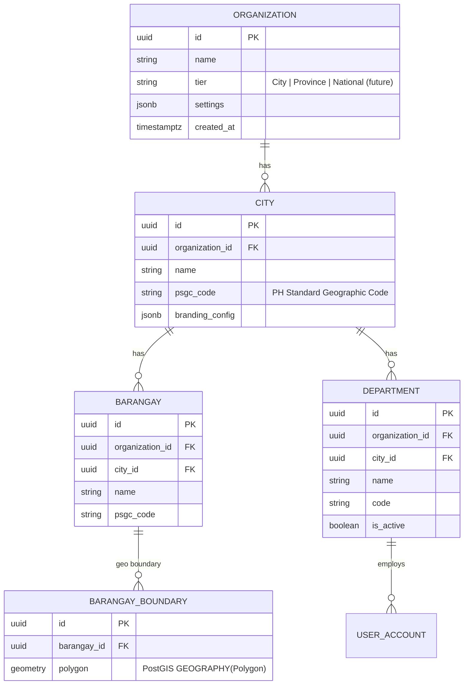
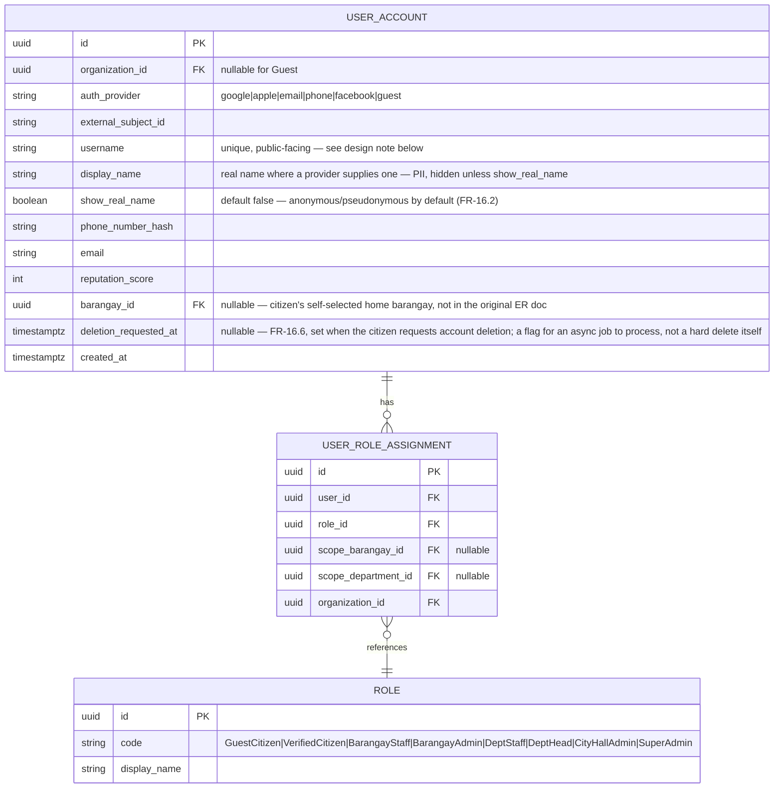
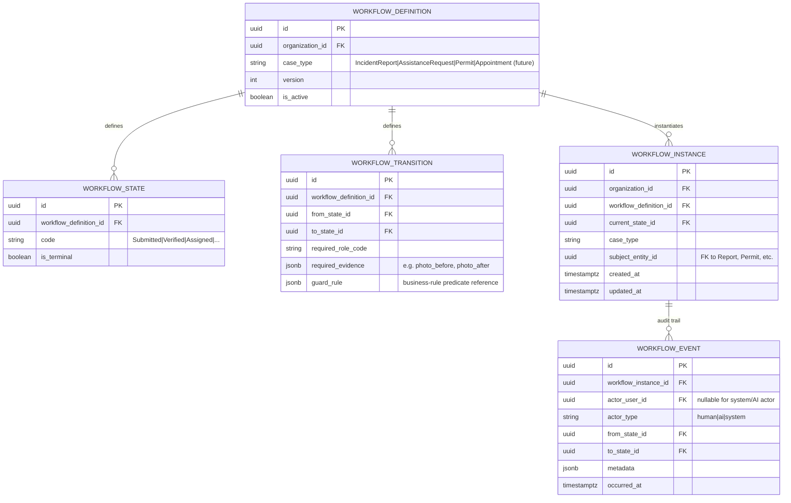
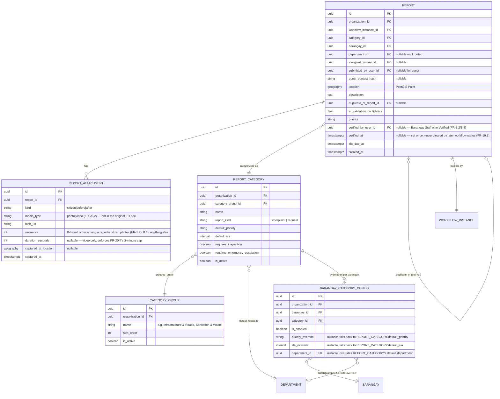
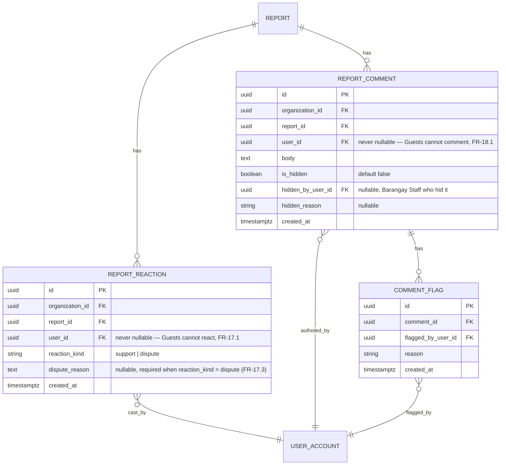
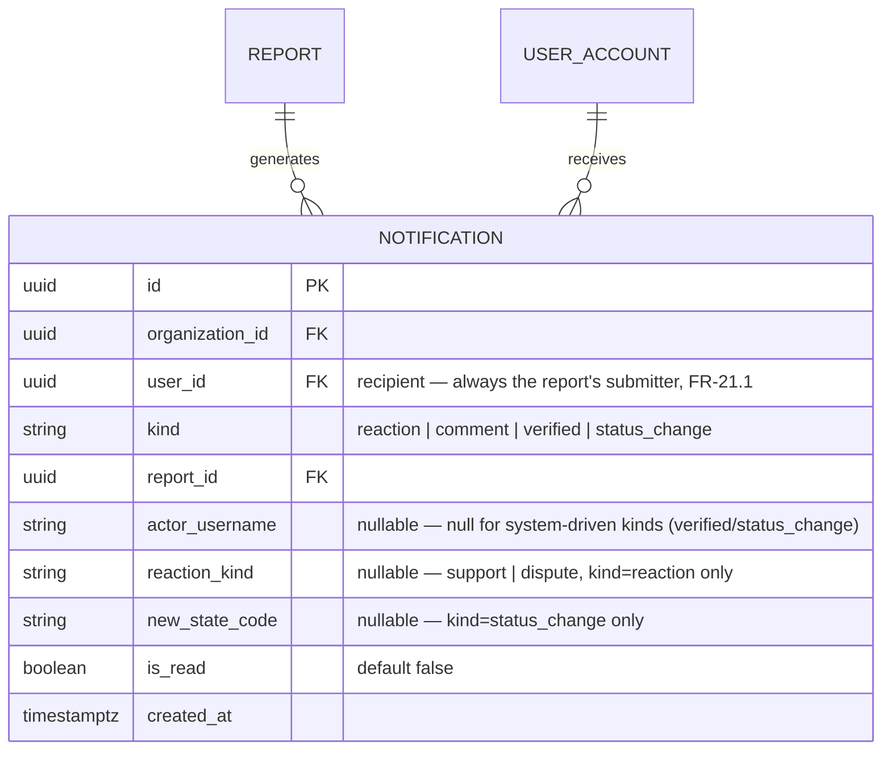

# Database Design & ER Model

Database: **PostgreSQL 16 + PostGIS**. Naming: singular PascalCase entities in this doc, mapped to `snake_case` tables via a TypeORM `SnakeNamingStrategy`. All identifiers are UUIDv7 (time-ordered, index-friendly, and safe to generate client-side without a round trip — relevant for offline draft creation, see [NFR — Offline Support](05-non-functional-requirements.md#offline-support)).

## Tenant scoping

Every tenant-owned table includes `organization_id UUID NOT NULL REFERENCES organization(id)`, indexed as the leading column of its primary access-pattern index (e.g., `(organization_id, status, created_at)` on `report`). This is enforced two ways, not one:

1. **Application layer:** a shared NestJS interceptor/guard resolves the current tenant and a TypeORM subscriber/base-repository wrapper injects `WHERE organization_id = @currentTenant` on every query against a tenant-scoped entity (see [Architecture — Multi-Tenancy](06-architecture.md#multi-tenancy-strategy)).
2. **Database layer (defense in depth):** PostgreSQL Row-Level Security (RLS) policies on tenant-scoped tables, keyed to a session variable set at the start of each request's transaction. If the application layer's filter is ever bypassed by a bug, RLS is the second, independent barrier — this is the difference between "we tried to prevent cross-tenant leaks" and "cross-tenant leaks are structurally impossible short of a superuser bypassing RLS deliberately," which matters enormously for a government-data product.

`Organization`, `City`, and reference/seed tables not owned by a single tenant (e.g., a shared national Barangay boundary dataset used as fallback) are the only tables without `organization_id`.

## Core entity groups

### 1. Tenancy & Government Hierarchy

**Design note — PSGC codes:** every `City` and `Barangay` stores the official Philippine Standard Geographic Code alongside its internal UUID. This is not decorative — it is the join key for any future integration with national datasets (PSA statistics, DILG reporting, disaster-response coordination with national agencies), and retrofitting it after tenants have organically-named barangays would require an error-prone reconciliation pass. Cheap to capture at onboarding, expensive to backfill.

### 2. Identity & Access

**Design note — `username` is the public identity, `display_name` is protected PII:** every other user-facing surface (comments, reactions, the transparency feed) reads `username`, never `display_name` — this is what makes FR-16.2's "anonymous by default" a schema-level guarantee rather than a UI convention someone can forget to apply on a new screen. `display_name` (the real name a provider like Google/Facebook supplies) is only ever rendered when `show_real_name = true`, and stays classified alongside `email`/`phone_number_hash` in the PII data class from [Security — Data Protection](09-security.md#data-protection).

**Design note — `barangay_id` is self-selected, not GPS-resolved:** the original design assumed a citizen's barangay would only ever be resolved from GPS at report-submission time (FR-4.1, `resolve_barangay()`), which needs `BarangayBoundary` polygon data to work at all. Before that data exists for a tenant, `resolve_barangay()` has nothing to match against and always returns null — so a citizen would never get routed to a barangay, and every report would sit with `barangay_id = null` indefinitely. This column lets the citizen pick their own "home" barangay from a plain list instead, which the client then sends explicitly at submission time; `report_before_insert` only falls back to GPS resolution when this wasn't supplied, so nothing here needs to change once real boundary data is imported.

**Design note — OAuth accounts get a username post-auth, not during:** Google/Apple/Facebook don't collect a username as part of their own sign-in flow, so `username` is nullable at row-creation time for those providers and enforced non-null by an application-layer gate instead (FR-16.3): first sign-in with a null `username` redirects to a mandatory completion screen before any other authenticated route is reachable, same enforcement pattern as the router's existing `_verifiedOnly` redirect guard. Email/OTP signup collects it directly in the signup form, so this gate never triggers for that provider.

**Design note — scoped role assignments, not global roles:** `UserRoleAssignment` carries an optional `scope_barangay_id`/`scope_department_id` rather than roles being purely global-per-organization. This is what lets one user be, e.g., Barangay Staff for Barangay A only, while another is City Hall Administrator across the whole City — and it's what the RBAC engine in [Security](09-security.md#authorization-model) evaluates against. A flat "role per organization" model (rejected) would force one of two bad outcomes: over-broad access (any Barangay Staff sees all barangays) or a proliferation of organization-per-barangay tenants (defeats the point of the City tenant).

### 3. Workflow Engine (generic)

`WORKFLOW_EVENT` **is** the audit log for every workflow-driven entity (FR-10) — a single, generic, append-only table rather than a separate audit table per module. This directly delivers FR-10.2 (no application-layer update/delete path is ever defined for this table) and means Permits, Appointments, and Inspections get full audit history for free the moment they're modeled as workflows, rather than each module needing to reinvent audit logging.

### 4. Incident Reporting (module-specific)

**Design note — `Report` references a `WorkflowInstance` (1:1) rather than embedding status directly:** the report's current status is always read through its `WorkflowInstance.current_state`, not a duplicated `status` column on `Report` itself. This avoids the classic bug class where a workflow-engine-driven status and a denormalized status column on the domain entity drift out of sync. The `Report` table stays focused on domain data (location, category, attachments); the Workflow Engine owns state and transitions exclusively.

**Design note — `verified_at` is a one-way flag, not derived from `current_state_code`:** it would be tempting to compute "is this report verified" from whether `current_state_code` has advanced past the Barangay-review checkpoint — but that list of qualifying states would need to be kept in sync by hand every time the workflow gains a new state, and a rejected-then-somehow-reopened report could accidentally read as verified depending on exactly which states are on that list. Recording the fact explicitly, once, at the moment FR-5.2's Verify action fires (and never clearing it) is simpler and can't drift. Same reasoning as `current_state_code` itself being a deliberate denormalization, below.

**Design note — `kind = 'citizen'` can have multiple rows per report (FR-1.2):** a report can carry several citizen photos (Facebook-album style), so there's deliberately no unique constraint on `(report_id, kind)` — `sequence` is what makes multiple `'citizen'`/`'photo'` rows orderable and distinguishable. A citizen video is still always exactly one row (FR-20.2's mutual exclusion with photos is enforced client-side, not by a DB constraint).

**Design note — `duration_seconds` is a stored fact, not just a client-side check:** FR-20.4's 3-minute cap is enforced client-side before upload (so a citizen never waits through a full upload only to be rejected), but storing the actual duration server-side means a `check` constraint can reject an upload that bypassed or lied to the client check — the same "don't trust the client alone" posture as tenant isolation elsewhere in this doc, applied to a much lower-stakes case.

**Design note — GPS as `geography`, not two floats:** using PostGIS `GEOGRAPHY(Point, 4326)` rather than separate `latitude`/`longitude` columns is what makes FR-3.1's radius-based duplicate search and FR-4.1's point-in-polygon barangay resolution simple, correct, and index-accelerated (`GIST` index) queries rather than manually implemented haversine math in application code — the latter is a common source of subtle correctness bugs (e.g., mishandling the antimeridian, or radius math that's wrong at scale) that PostGIS has already solved and battle-tested.

**Design note — `BarangayCategoryConfig` is a sparse override, not a per-barangay copy of the catalog:** `ReportCategory` still belongs to the organization (city) — FR-11's City Hall Administrator manages one citywide catalog, not one per barangay. `BarangayCategoryConfig` exists only where a barangay's reality differs from the city default: disabling a category it doesn't need, or overriding priority/SLA/routing department (e.g., a flood-prone barangay escalates Drainage/Flooding faster than others). This is also where FR-4.2's already-specified "(Category × Barangay) configuration mapping" for department routing concretely lives — it isn't new scope, it's the table that requirement was always going to need. **Absence of a row for a (barangay, category) pair means "inherit the city default," not "disabled"** — so onboarding a new barangay needs zero override rows to get sane defaults, consistent with FR-13.1's <1-business-day onboarding target ([FR-15.2](04-functional-requirements.md#fr-15--category-taxonomy-groups-barangay-overrides--request-routing)).

**Design note — category selection happens before the barangay is known:** in the citizen app's report flow (category → capture → review), the category is picked before GPS is captured, so `BarangayCategoryConfig.is_enabled = false` cannot filter the category picker at selection time — the barangay isn't resolved until FR-4.1 runs against the captured GPS. The category screen renders the organization-wide active catalog; a category disabled for the citizen's resolved barangay is instead caught server-side at submission time (the same place FR-4.1/FR-4.2 already run), with a clear rejection reason rather than a silent drop or reroute (FR-15.3). Expected to be a rare path in practice — overrides are the exception, not the rule.

**Design note — `report_kind` reuses the Workflow Engine instead of forking the schema:** `ReportCategory.report_kind` (`complaint` | `request`) distinguishes categories like "Requests for Assistance" that need different handling (e.g., relief/medical aid intake) from standard incident complaints. A `request`-kind category simply resolves to a different `WorkflowDefinition.case_type` (`AssistanceRequest`, alongside `IncidentReport`) — reusing the generic Workflow Engine (FR-14) rather than forking `Report`/`ReportAttachment` into parallel tables. **The actual states/transitions for `AssistanceRequest` are out of scope here** — this only makes the data model capable of routing a request differently; the request-handling workflow itself needs its own requirements pass before implementation (FR-15.4).

**Open flag — two categories may describe the same physical issue:** the submitted catalog includes both "Broken Streetlights" (Infrastructure & Roads) and "Street Lighting Safety Concerns" (Public Safety & Peace) — acknowledged as overlapping in the source list itself. Because FR-3.1's duplicate check matches "for the same category," two citizens reporting the same broken streetlight under these two different categories won't be caught as duplicates. Not resolved in this change — either merge into one category with `is_priority` covering both intents, or accept the dedup gap for this specific pair. Worth a decision before this ships, not urgent for the schema itself.

### 5. Community Engagement (reactions & comments) `[PROPOSED — see FR-17/FR-18]`

**Design note — one reaction per (report, user), not a reaction log:** `REPORT_REACTION` has a unique constraint on `(report_id, user_id)` — casting a new reaction updates the existing row rather than inserting a second one. A user holding both "support" and "dispute" on the same report simultaneously isn't a real state per FR-17.1, so the schema doesn't allow representing it.

**Design note — flag-then-review, not delete-then-forget:** `REPORT_COMMENT.is_hidden` is a flag, not a delete — a hidden comment's row (and its author) is preserved for the audit trail (FR-10, FR-18.3), consistent with how `WORKFLOW_EVENT` is never deleted either. `COMMENT_FLAG` is append-only, same reasoning as `WORKFLOW_EVENT` — no update/delete path should exist for it at the application layer.

**Design note — reuses Barangay Staff, not a new moderation role:** flagged comments surface to the same Barangay Staff role that already reviews reports (FR-5), scoped to their barangay via the existing `scope_barangay_id` role assignment — no new `ROLE` value, no new RBAC scope concept. Consistent with FR-18.2's "reuse the human backstop that already exists" framing.

## 6. Notifications (FR-21)

**Design note — populated by triggers only, never client-written:** every `NOTIFICATION` row is inserted by a `security definer` trigger on `REPORT_REACTION`/`REPORT_COMMENT`/`REPORT` — the client's only write path is flipping `is_read`. This mirrors `WORKFLOW_EVENT`'s "the client has no business supplying facts about itself" posture, just applied to a table the client actually reads back (unlike `WORKFLOW_EVENT`, this one needs a `select` policy scoped to the recipient).

**Design note — `actor_username` denormalized, not joined at read time:** `NOTIFICATION` has two foreign keys into `USER_ACCOUNT` (the recipient `user_id`, and conceptually an actor) — PostgREST can't auto-embed a table reached by two different FKs without an explicit constraint-name hint. Capturing the actor's username once, at insert time, avoids that ambiguity entirely rather than working around it on every read.

**Design note — structured facts, not a pre-rendered message:** `kind`/`reaction_kind`/`new_state_code` are stored as data, not as a formatted sentence — the mobile client builds the display string itself (`AppNotification.body`), reusing `ReportStatus.label`'s existing formatting rather than duplicating it as string concatenation in a Postgres trigger. Keeps status-label wording in exactly one place.

## Indexing strategy (MVP-critical)

| Index | Purpose |
|---|---|
| `report(organization_id, barangay_id, current_state, created_at)` (via workflow join or denormalized state cache — see below) | Barangay queue load (FR-5.1), the highest-frequency staff query |
| `report USING GIST(location)` | Duplicate radius search (FR-3.1), barangay point-in-polygon resolution (FR-4.1) |
| `barangay_boundary USING GIST(polygon)` | Same |
| `workflow_event(workflow_instance_id, occurred_at)` | Audit trail retrieval for a single case |
| `user_role_assignment(user_id, organization_id)` | Auth/permission resolution on every authenticated request — must be fast, it's on the hot path |
| `barangay_category_config(barangay_id, category_id)` UNIQUE | Override lookup at submission time (FR-4.2/FR-15.2) — one row max per (barangay, category) pair |
| `report_reaction(report_id, user_id)` UNIQUE | Enforces one reaction per user per report (FR-17.1); also the lookup for "did I already react" on report detail load |
| `report_comment(report_id, created_at)` | Comment thread retrieval for a single report, chronological |
| `comment_flag(comment_id)` | Barangay Staff review queue lookup (FR-18.2) |

**Deliberate denormalization called out:** to avoid an expensive join to `WorkflowInstance`/`WorkflowState` on every dashboard query, `Report` maintains a denormalized `current_state_code` column, updated transactionally in the same write as the `WorkflowEvent` insert. This is a standard CQRS-adjacent read-optimization, not a violation of "status lives in the workflow engine" — the `WorkflowInstance` remains the source of truth; the denormalized column is a cache invalidated within the same transaction, never written independently.

## Data retention & deletion

- `WORKFLOW_EVENT` (audit log) is retained indefinitely by default — it is the platform's accountability record and a likely subject of future transparency/FOI requirements.
- Citizen accounts support data-subject erasure requests (RA 10173 compliance, see [Security](09-security.md#compliance)): PII fields on `USER_ACCOUNT` are nulled/anonymized on request, but `WORKFLOW_EVENT` and `REPORT` rows are retained with the actor reference pointing to an anonymized placeholder, preserving audit integrity without retaining erasable PII.

## Seed Data — Default Category Catalog

Initial `CategoryGroup`/`ReportCategory` load for a new City tenant (FR-13.1). All rows are `report_kind: complaint` unless noted. `is_priority` is set only where explicitly flagged at intake — it is not inferred for every category that sounds urgent, to avoid priority inflation diluting the signal for the ones that are actually flagged.

| Group | Category | report_kind | is_priority | Notes |
|---|---|---|---|---|
| Infrastructure & Roads | Potholes/Road Damage | complaint | | |
| Infrastructure & Roads | Broken Streetlights | complaint | | overlaps "Street Lighting Safety Concerns" below — see open flag above |
| Infrastructure & Roads | Damaged Sidewalks | complaint | | |
| Infrastructure & Roads | Drainage/Flooding Issues | complaint | | |
| Infrastructure & Roads | Broken Public Facilities | complaint | | benches, waiting sheds, restrooms, plaza equipment |
| Sanitation & Waste | Uncollected Garbage | complaint | | missed pickup, overflowing bins |
| Sanitation & Waste | Illegal Dumping | complaint | | vacant lots, waterways, roadsides |
| Sanitation & Waste | Sewage/Wastewater Issues | complaint | | leaking/overflowing septic or sewage lines |
| Sanitation & Waste | Public Area Cleanliness | complaint | | markets, parks, common areas |
| Public Safety & Peace | Street Lighting Safety Concerns | complaint | **yes** | dark areas prone to crime; overlaps "Broken Streetlights" above |
| Public Safety & Peace | Noise Complaints | complaint | | |
| Public Safety & Peace | Stray Animals | complaint | | aggressive/unmanaged dogs or cats |
| Public Safety & Peace | Vandalism | complaint | | graffiti, property damage |
| Public Safety & Peace | Illegal Structures | complaint | | unauthorized construction, informal settlers on public land |
| Health & Environment | Mosquito/Pest Breeding Sites | complaint | | stagnant water, dengue-prone areas |
| Health & Environment | Air/Water Pollution | complaint | | smoke-belching, foul odor, contaminated water |
| Health & Environment | Illegal Vending/Health Violations | complaint | | unsanitary food stalls, unlicensed vendors |
| Traffic & Transportation | Traffic Violations | complaint | | illegal parking, colorum vehicles, obstruction |
| Traffic & Transportation | Damaged Traffic Signs/Signals | complaint | | |
| Traffic & Transportation | Public Transport Complaints | complaint | | overcharging, reckless driving |
| Utilities | Water Supply Issues | complaint | | leaks, low pressure, no supply |
| Utilities | Power Outage/Electrical Hazards | complaint | | exposed wires, recurring outages |
| Utilities | Internet/Telecom Infrastructure | complaint | | fallen cables, damaged poles |
| Social Services & Welfare | Missing/Damaged Public Signage | complaint | | barangay info, evacuation routes |
| Social Services & Welfare | Requests for Assistance | **request** | | relief goods, medical aid — routes to a distinct workflow, see `report_kind` design note above |

25 categories across 7 groups. Seeded per-organization at tenant onboarding (FR-13.1); no `BarangayCategoryConfig` rows are seeded by default — every barangay inherits the city catalog as-is until a City Hall Administrator overrides one.
